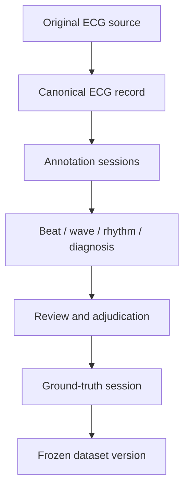
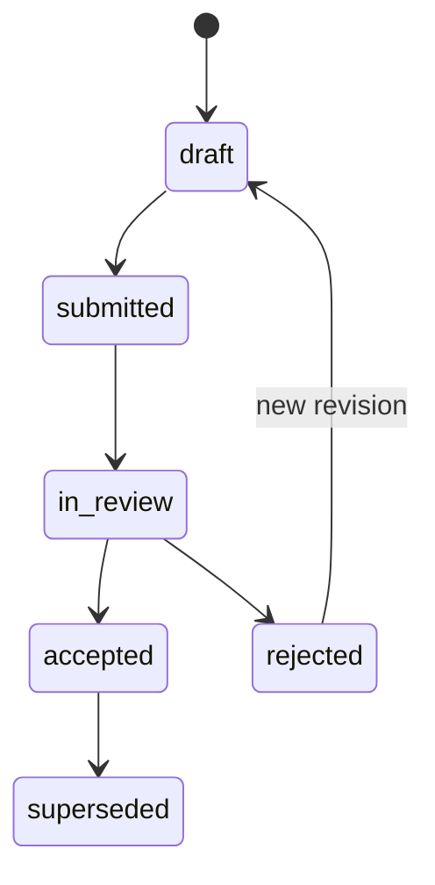
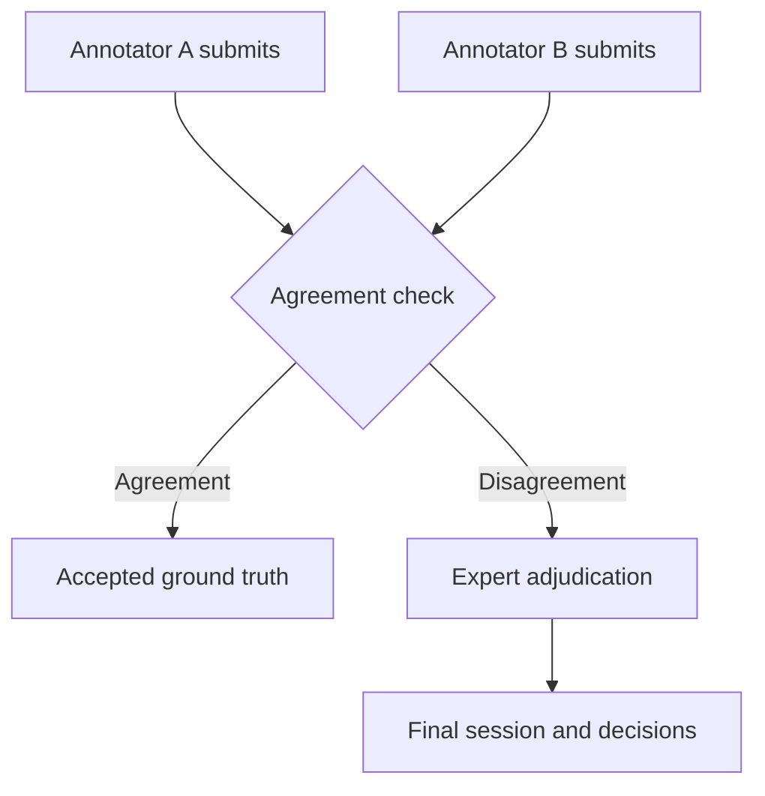

# ECG-LEVEL-5 Technical Specification

Status: implemented schema foundation  
Migration: `supabase/migrations/202609020002_ecg_level_5_schema.sql`  
Client contract: `src/lib/level5.js`

## 1. Purpose

ECG-LEVEL-5 extends LabelECG from a record-level interpretation application into a research-grade ECG annotation and dataset-generation platform. It preserves all Level 4 tables and workflows while adding:

- immutable source provenance;
- de-identified patient grouping;
- versioned annotation protocols;
- independent annotation sessions;
- beat, wave, rhythm, measurement and diagnosis annotations;
- double review and expert adjudication;
- controlled vocabulary;
- dataset membership and assignments;
- reproducible dataset releases;
- enforced patient-level train/validation/test separation;
- an append-only research audit trail.

The migration is additive. Existing rows in `datasets`, `ecg_records`, `ecg_raw_data`, `annotations` and `annotation_history` remain valid.

## 2. Architectural principles

1. **Waveform-centric:** the canonical research object is a sampled ECG signal. PDF and image files are preserved as source/reference objects.
2. **Sample-addressed:** beat and waveform annotations use zero-based sample coordinates, not screen pixels.
3. **No destructive overwrite:** submitted sessions are locked. Later changes require a new session linked through `parent_session_id`.
4. **Provenance first:** original and derived files carry a source type, object path, SHA-256 hash, acquisition metadata and parent relationship.
5. **Human ground truth:** AI output is stored as `ai_preannotation`; it never becomes final ground truth without a submitted clinician session or adjudication.
6. **Patient-level isolation:** the same `subject_key` cannot be assigned to different ML splits inside one dataset version.
7. **Least privilege:** access is dataset-scoped and roles are assigned by dataset managers.
8. **Reproducibility:** every frozen dataset release records its protocol, split strategy, seed and manifest hash.

## 3. Logical architecture



## 4. Canonical ECG record

`ecg_records` remains the central record table. Level 5 adds:

| Field | Meaning |
|---|---|
| `study_uid` | Stable UUID for cross-system reference |
| `subject_key` | De-identified patient grouping key |
| `acquisition_time` | Recording time, when retained by protocol |
| `lead_count` | Number of recorded leads |
| `duration_ms` | Recording duration in milliseconds |
| `quality_status` | `unreviewed`, `acceptable`, `limited`, or `unusable` |
| `deidentified_at` | Timestamp confirming de-identification |

For migrated records, `subject_key` is initialized from the existing `patient_id`. Before research use, replace any identifying value with a random study subject identifier.

The digital signal remains in `ecg_raw_data` for backward compatibility. At scale, source/canonical WFDB objects should be stored in private object storage and registered in `ecg_sources`.

## 5. Source provenance

`ecg_sources` records every original or derived representation:

- CSV
- WFDB
- DICOM
- SCP-ECG
- XML
- PDF
- image
- vendor binary
- derived artifact

Each source can include:

- private storage bucket and path;
- original filename and media type;
- SHA-256 and byte size;
- device manufacturer/model;
- acquisition software;
- sampling rate, gain, unit and lead names;
- `parent_source_id` for a derived representation;
- arbitrary vendor metadata in JSON.

An original PDF and its digitized WFDB derivative are therefore separate, linked objects.

## 6. Access model

`dataset_members` assigns one dataset-specific role per user:

| Role | Intended capability |
|---|---|
| `owner` | Full dataset control |
| `manager` | Membership, assignments and releases |
| `annotator` | Assigned primary/secondary annotation |
| `reviewer` | Review submitted sessions |
| `adjudicator` | Resolve disagreements and approve ground truth |
| `viewer` | Read-only access |

Existing dataset uploaders are backfilled as owners. New dataset uploaders are added automatically by a trigger.

`annotation_assignments` links a user to a record with an annotation, review or adjudication responsibility and tracks due date and workflow status.

RLS helper functions:

- `is_platform_admin()`
- `can_access_dataset(dataset_id)`
- `can_manage_dataset(dataset_id)`
- `session_is_editable(session_id)`

Annotation rows can be changed only while their parent session is an unlocked draft owned by the signed-in user.

The migration deliberately leaves the original Level 4 table policies unchanged so the current production interface is not broken during rollout. Before storing identifiable clinical data, complete the cutover by assigning all permitted users in `dataset_members`, updating the Level 4 `datasets`, `ecg_records`, `ecg_raw_data`, `annotations` and Storage policies to call `can_access_dataset`, and testing every role. New Level 5 tables are dataset-scoped from their first use.

## 7. Annotation protocols

`annotation_protocols` versions the scientific instructions and machine-readable definition used for a project.

Required protocol content should include:

- lead convention;
- sample-coordinate rules;
- permitted beat and rhythm labels;
- waveform landmark definitions;
- diagnostic vocabulary;
- quality rejection rules;
- minimum reviewer count;
- disagreement threshold;
- adjudication policy;
- software/model version used for pre-annotation.

Protocol states are `draft`, `active`, and `retired`. Existing sessions retain their protocol reference when a newer protocol is activated.

## 8. Annotation sessions

`annotation_sessions` is the unit of authorship, review and versioning.

Session types:

- `primary`
- `secondary`
- `review`
- `adjudication`
- `ai_preannotation`

Session states:



The application submits through `submit_annotation_session(session_uuid)`. Submission sets `submitted_at`, locks the session and prevents later child-row edits.

A revision is a new session with:

- `parent_session_id` pointing to the earlier session;
- the same `ecg_record_id`;
- an incremented `round_number`.

The database rejects a parent session belonging to a different ECG.

## 9. Annotation coordinate system

All waveform locations use a zero-based integer sample index relative to the canonical signal start.

Conversion:

```text
time_seconds = sample_index / sampling_rate_hz
sample_index = round(time_seconds × sampling_rate_hz)
```

Screen coordinates must never be persisted as the only ground truth. Image-region marks from Level 4 may remain reference annotations, but Level 5 waveform labels use samples.

Lead names should use canonical values where applicable:

```text
I, II, III, aVR, aVL, aVF, V1, V2, V3, V4, V5, V6
```

## 10. Annotation tables

### Beat annotations

`beat_annotations` stores one event at `sample_index`, optionally lead-specific.

Initial beat vocabulary:

- normal
- PAC
- PVC
- paced
- fusion
- escape
- junctional
- artifact
- unknown

### Wave annotations

`wave_annotations` supports:

- P onset, peak and offset;
- QRS onset;
- Q, R and S peaks;
- QRS offset;
- J point;
- T onset, peak and offset.

Ordering constraints prevent reversed onset/peak/offset pairs. Partial annotation is allowed.

### Rhythm annotations

`rhythm_annotations` stores half-open sample intervals:

```text
[start_sample, end_sample)
```

`end_sample` must be greater than `start_sample`.

### Measurements

`measurement_annotations` stores a numeric value, unit, method, optional lead and optional sample interval. Recommended initial codes:

- `HEART_RATE`
- `PR_INTERVAL`
- `QRS_DURATION`
- `QT_INTERVAL`
- `QTC_BAZETT`
- `QTC_FRIDERICIA`
- `QRS_AXIS`
- `ST_DEVIATION`

### Diagnoses

`diagnosis_annotations` supports controlled and external codes. A row must reference either:

- `diagnosis_term_id`, or
- `code_system` plus `diagnosis_code`.

It also records certainty, presence/absence, lead scope, optional sample interval and confidence.

`diagnosis_terms` is seeded with a small local vocabulary and can later map to SNOMED CT, SCP-ECG statements or another licensed terminology.

## 11. Review and adjudication

Recommended workflow:



`adjudications` defines the case. `adjudication_inputs` links the competing sessions; a trigger requires all inputs to belong to the adjudicated ECG. `adjudication_decisions` stores the final value and source annotation IDs for each disputed item.

`final_session_id` identifies the clinician-approved ground-truth session used by a dataset release.

## 12. Dataset releases

`dataset_versions` records:

- semantic version;
- status;
- annotation protocol;
- inclusion/exclusion criteria;
- split seed and strategy;
- manifest SHA-256;
- freeze and publication timestamps.

States:

```text
draft → frozen → published → retired
```

`dataset_version_records` fixes the exact ECGs, ground-truth sessions, subject keys and splits in a release.

The `enforce_patient_level_split` trigger rejects a subject placed in more than one of train, validation, test or external inside the same version.

The `freeze_dataset_version(version_uuid, manifest_hash)` function refuses to freeze when:

- any record remains `unassigned`;
- any record lacks a ground-truth session;
- the caller is not a dataset manager;
- the version is not a draft.

## 13. Audit and traceability

`audit_events` is append-only through RLS and records:

- actor;
- dataset;
- entity type and ID;
- event type;
- old and new JSON values;
- request/correlation ID;
- timestamp.

Recommended auditable events:

- assignment created or cancelled;
- session created, submitted, accepted or rejected;
- adjudication opened or resolved;
- source registered;
- dataset version frozen or published;
- membership or role changed.

Existing `annotation_history` continues to track the legacy Level 4 annotation table.

## 14. Client service contract

`src/lib/level5.js` exposes:

- `level5ProtocolService`
- `level5AssignmentService`
- `level5SourceService`
- `level5AnnotationService`
- `level5DatasetVersionService`

The service supports:

- protocol and diagnosis-term discovery;
- assignment queues;
- source registration;
- session creation and bundle loading;
- beat, wave, rhythm, measurement and diagnosis creation;
- atomic session submission;
- dataset release creation, population and freezing.

The existing `src/lib/supabase.js` remains the Level 4 compatibility service.

## 15. Example annotation bundle

```json
{
  "session": {
    "session_type": "primary",
    "round_number": 1,
    "status": "submitted",
    "protocol": "ECG Core 1.0"
  },
  "beats": [
    { "sample_index": 5367, "lead_name": "II", "beat_type": "pvc" }
  ],
  "waves": [
    {
      "lead_name": "II",
      "beat_sample": 5367,
      "qrs_onset": 5310,
      "r_peak": 5367,
      "qrs_offset": 5415
    }
  ],
  "rhythms": [
    { "start_sample": 0, "end_sample": 5000, "rhythm_code": "SINUS_RHYTHM" }
  ],
  "diagnoses": [
    { "code": "PVC", "display_text": "Premature ventricular complexes", "certainty": "definite" }
  ]
}
```

## 16. Migration procedure

1. Back up the Supabase database.
2. Apply the existing Level 4 schema/migrations if not already present.
3. Apply `202609020001_repair_auth_profiles.sql`.
4. Apply `202609020002_ecg_level_5_schema.sql`.
5. Verify existing dataset uploaders appear as `owner` in `dataset_members`.
6. Replace identifying `subject_key` values with study identifiers before research use.
7. Create and activate the first annotation protocol.
8. Assign users to datasets before using Level 5 services.

The migration does not delete or rename existing columns and is safe to stage before the Level 5 UI is enabled.

## 17. Verification checklist

- Existing Level 4 login and dashboard still load.
- Existing datasets have an owner membership.
- A member can create a draft session.
- A non-member cannot read the session.
- The session owner can add child annotations while draft.
- Submission locks the session.
- Child annotations cannot be changed after submission.
- An adjudication cannot reference another ECG's session.
- A dataset release cannot include another dataset's record.
- One subject cannot appear in multiple ML splits.
- A release cannot freeze without ground truth and assigned splits.

## 18. Deliberately deferred implementation

This schema foundation does not yet implement:

- WFDB/DICOM/SCP-ECG parsers;
- PDF/image waveform digitization;
- object-storage upload workers for every source type;
- the Level 5 annotation UI;
- automated inter-rater statistics;
- AI pre-annotation models;
- DVC/Parquet/WFDB export jobs;
- regulatory validation or institutional compliance certification.

Those components should build against this versioned schema rather than introduce parallel annotation storage.
